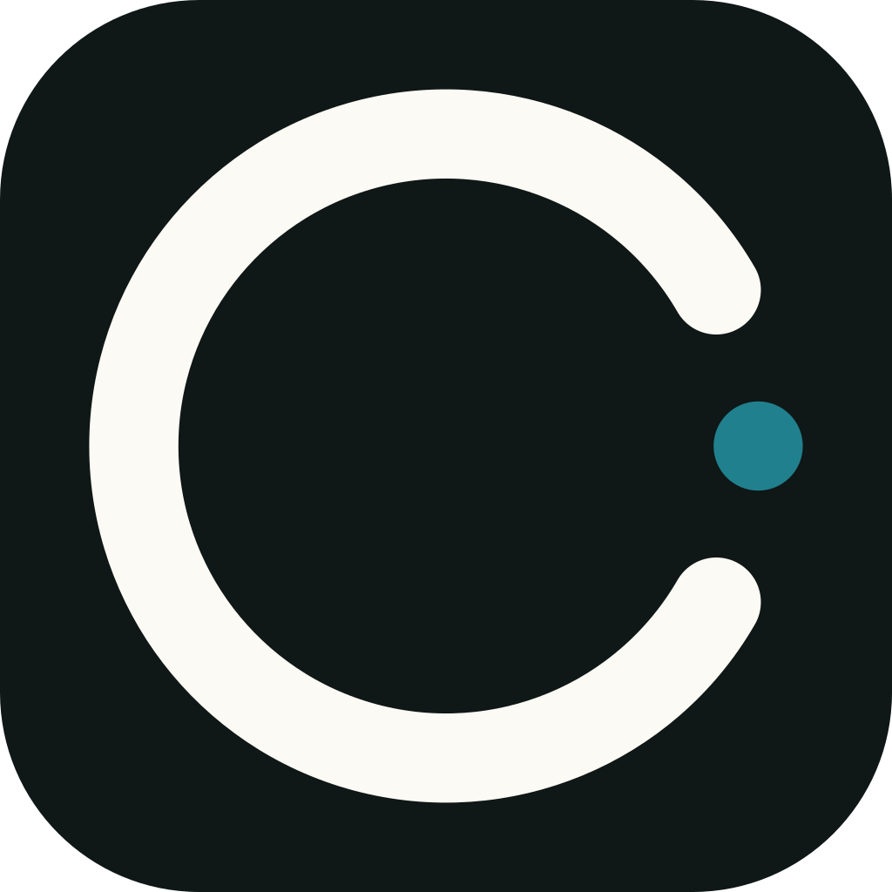

<p align="center">
  
</p>

<h1 align="center">rekody</h1>

<p align="center"><strong>/ˈrɛ.kə.di/</strong> — record + melody, the rhythm of your voice becoming text.</p>

**Open-source, privacy-first voice dictation for the terminal.**

Hold `⌥Space`, speak, release. Your words appear at the cursor — anywhere on your desktop.

---

## Quick Start

```bash
# Install via Homebrew (recommended)
brew tap tonykipkemboi/rekody
brew install rekody

# Or one-line installer (no Homebrew needed)
curl -fsSL https://raw.githubusercontent.com/tonykipkemboi/rekody/main/install.sh | bash

# Or build from source
git clone https://github.com/tonykipkemboi/rekody.git
cd rekody
make install

# First run launches the setup wizard
rekody
```

**Requirements:** macOS (Apple Silicon or Intel).

```bash
# Update
brew upgrade rekody
# or
rekody update
```

---

## Usage

```
rekody [COMMAND]

Commands:
  (none)   Run voice dictation
  setup    Re-run first-time setup / reconfigure
  config   Show or edit current configuration
  history  Browse dictation history
  doctor   Test STT and LLM provider connectivity
  key      Manage API keys in the system keychain
  update   Update to the latest release

Options:
  -v, --verbose    Enable debug tracing
  -h, --help       Print help
  -V, --version    Print version
```

### Hotkey

| Mode | Shortcut | Behaviour |
|------|----------|-----------|
| **Push-to-talk** (default) | `⌥Space` | Hold to record, release to transcribe |
| **Toggle** | `⌥Space` | Tap to start, tap again to stop |

> **macOS:** rekody uses an active `CGEventTap` so `⌥Space` is fully suppressed — it will not insert a non-breaking space into your focused window. Requires **Accessibility** permission (System Settings → Privacy & Security → Accessibility).

### macOS permissions

rekody needs two TCC permissions:

| Permission | Why | Granted to |
|------------|-----|------------|
| **Accessibility** | Suppress `⌥Space` before it reaches the focused app (so it doesn't type a non-breaking space) | `rekody` binary |
| **Microphone** | Capture audio for transcription | **Your terminal** (see below) |

> **Why "Terminal.app" (or iTerm / Warp / Ghostty) shows up in your Microphone list instead of rekody:** macOS TCC attributes microphone access to the *responsible process* of a CLI app, which for terminal-launched binaries is the parent terminal emulator — not rekody itself. This is a system-level design, not a bug. The permission granted to your terminal applies to every command you run inside it, including rekody.
>
> If you've granted microphone access to your terminal once, rekody will work. If the permission is missing or denied, `rekody setup` will prompt for it eagerly; `rekody doctor` probes the device and shows the current state.

### Configuration

```bash
rekody config          # show current config
rekody config edit     # open config.toml in $EDITOR
rekody config path     # print config file location
```

Config file lives at `~/.config/rekody/config.toml`.

**All options:**

```toml
activation_mode = "push_to_talk"   # "push_to_talk" | "toggle"
injection_method = "clipboard"     # "clipboard" | "native"
vad_threshold = 0.01               # RMS energy threshold (0.005–0.05)
whisper_model = "tiny"             # "tiny" | "small" | "medium" | "large"

# STT engine
stt_engine = "deepgram"            # "local" | "deepgram" | "groq" | "cohere"
deepgram_api_key = "dg_..."        # required when stt_engine = "deepgram"

# LLM post-processing (omit or set false to disable)
# Auto-disabled when stt_engine = "deepgram" (smart_format handles cleanup)
llm_enabled = false                # true | false | omit for auto

# LLM providers — tried in order, first success wins
[[providers]]
name = "groq"
api_key = "gsk_..."
model = "openai/gpt-oss-20b"

[[providers]]
name = "ollama"            # local fallback, no key needed
model = "llama3.2:3b"
```

### API Keys

Keys are stored in the macOS Keychain — never in plaintext on disk.

```bash
rekody key set deepgram     # securely prompt + save
rekody key set groq
rekody key list             # show which keys are stored
rekody key delete groq      # remove a key
```

### History

```bash
rekody history                    # last 20 dictations
rekody history -c 50              # last 50
rekody history -s "bug fix"       # search by text
rekody history -a "VS Code"       # filter by app
rekody history --full             # show full text + raw transcript
rekody history --stats            # usage statistics + top apps
rekody history --json             # raw JSON output (pipe-friendly)
rekody history --copy 1           # copy latest entry to clipboard
rekody history --copy 3           # copy 3rd-most-recent to clipboard
```

History is stored at `~/.config/rekody/history.json` (up to 5,000 entries).

### Doctor

```bash
rekody doctor    # live connectivity check for all configured providers
```

---

## STT Engines

| Engine | Quality | Latency | Notes |
|--------|---------|---------|-------|
| `deepgram` | ★★★★★ | ~200ms | Nova-3, smart formatting, cloud |
| `groq` | ★★★★☆ | ~300ms | Whisper Large v3, cloud |
| `local` | ★★★☆☆ | varies | On-device whisper.cpp, Metal GPU, offline |
| `cohere` | ★★★★☆ | varies | Local server on configurable port |

**Recommended:** `deepgram` — fastest, most accurate, already produces clean punctuated output (no LLM needed on top).

---

## LLM Providers

LLM post-processing cleans filler words, fixes grammar, and adapts formatting to the active app (code editor, chat, email, etc.). **Automatically disabled when using Deepgram** since it already formats output.

| Provider | Type | Default model |
|----------|------|---------------|
| `groq` | Cloud | `openai/gpt-oss-20b` |
| `cerebras` | Cloud | `llama3.1-8b` |
| `together` | Cloud | `meta-llama/Meta-Llama-3.1-8B-Instruct-Turbo` |
| `openrouter` | Cloud | `llama-3.1-8b-instruct:free` |
| `fireworks` | Cloud | user's choice |
| `openai` | Cloud | `gpt-4o-mini` |
| `anthropic` | Cloud | `claude-sonnet-4-20250514` |
| `gemini` | Cloud | `gemini-2.0-flash` |
| `ollama` | Local | `llama3.2:3b` |
| `lm-studio` | Local | loaded model |
| `vllm` | Local | user's choice |
| `custom` | Any | user's choice |

Multiple providers fall back automatically: first success wins.

---

## Architecture

```
⌥Space ──▶ CGEventTap ──▶ AudioCapture ──▶ VAD ──▶ STT ──▶ LLM (optional) ──▶ Inject
           (suppresses     cpal/rubato    RMS    Deepgram/  provider chain   clipboard/
            key event)     16kHz mono     based  Whisper/   with failover    CGEvent)
                                                 Local
```

```
rekody/
├── crates/
│   ├── rekody-core      Pipeline orchestrator, config, onboarding, context detection
│   ├── rekody-audio     Microphone capture, resampling, energy-based VAD
│   ├── rekody-stt       Deepgram Nova-3, Groq Whisper, local whisper.cpp, Cohere
│   ├── rekody-llm       11 LLM providers + custom, automatic failover chain
│   ├── rekody-inject    Text injection: clipboard paste + native CGEvent/SendInput
│   └── rekody-hotkey    Global ⌥Space listener via CGEventTap (active, suppressing)
└── config/
    └── default.toml      Template configuration
```

---

## Security

- **Audio never leaves your machine** unless you choose a cloud STT engine.
- **LLM calls send only the transcript text** — never raw audio.
- **API keys stored in system keychain** (macOS Keychain) — not in config files or env vars.
- **Config file chmod 0600** — readable only by the owning user.
- **History file chmod 0600** — same protection.
- **Active event tap** suppresses `⌥Space` before it reaches other apps.
- **No telemetry, no analytics, no phone-home.**

---

## For AI Agents

rekody is designed to be easy for AI coding agents to install and configure:

```bash
# Point your agent at this file, then:
# "Install rekody and set it up with Deepgram"

# Quick machine-readable status
rekody doctor --json 2>/dev/null || rekody --version

# Non-interactive config update
rekody config path           # get config file path
# then edit ~/.config/rekody/config.toml directly

# Set a key non-interactively (via security CLI)
security add-generic-password -s "com.rekody.voice" -a "deepgram" -w "YOUR_KEY" -U

# Get history as JSON for downstream processing
rekody history --json -c 100

# Copy last transcript to clipboard
rekody history --copy 1
```

**SKILLS.md** contains a structured agent onboarding guide — point your agent at it:

> "Read SKILLS.md and set up rekody for voice dictation on this machine."

---

## Contributing

See [CONTRIBUTING.md](CONTRIBUTING.md) for development setup.

```bash
cargo build -p rekody-core --release    # build
cargo test                              # test
make install                            # build + install to /usr/local/bin
```

---

## License

[MIT](LICENSE)
